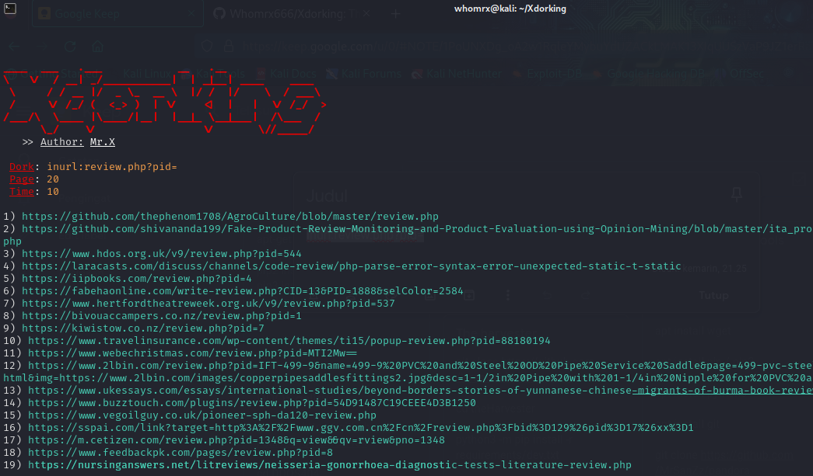

# Xdorking 


## Attention
Use this tool on Linux or other Linux-based devices, for cellphones use the Shell cloud terminal or nethunter.

## Instalations
```
$ pkg install git python
$ git clone https://github.com/Whomrx666/Xdorking 
$ cd Xdorking
$ pip install -r requirements.txt
$ python Xdorking.py
```

## Instructions
- **Dork**: the search query you'd like to use
- **Page**: the amount of websites to display
- **Time**: the time interval between requests

### Original Author
<a href="https://github.com/Whomrx666"></a>

Follow me: [Whatsapp](https://wa.me/6287855190571),[Youtube](https://youtube.com/@whomrx666),[Tiktok](https://www.tiktok.com/@whomr.x),[Facebook](https://www.facebook.com/whomrx.666),[Telegram](https://t.me/@Whomr_X),&[Website](https://whomrxhackers.blogspot.com/)

